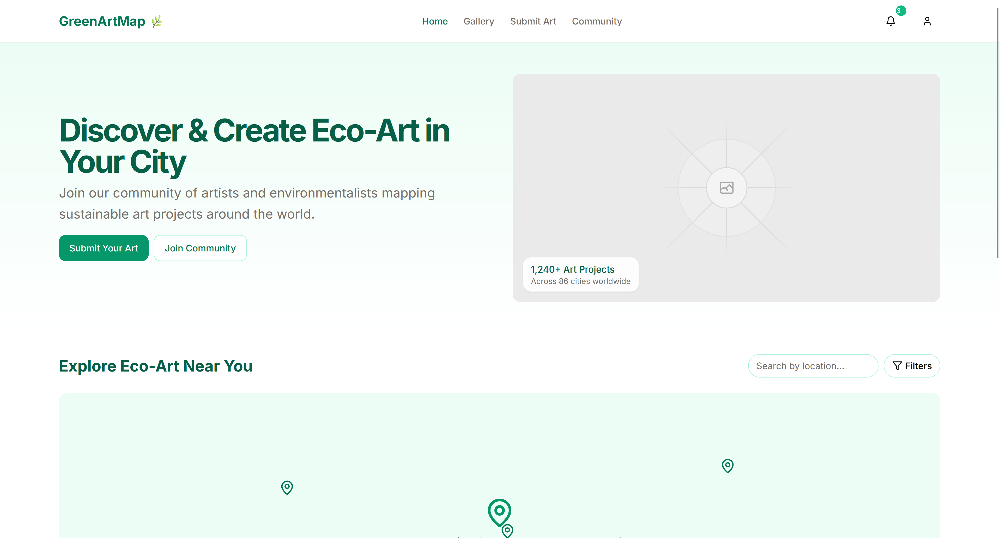

# 🌿 GreenArtMap

GreenArtMap is a web platform that showcases eco-friendly street art across a city. It allows users to explore sustainable artwork on an interactive map, submit their own eco-art, and engage with the community through votes and comments. It's built for artists, citizens, and environmentalists who care about greener cities and creativity.

---

## ✨ Features

### 🧭 Public Users
- 🌍 Browse a Leaflet map with eco-art pins
- 🖼️ View art details (image, title, location, materials used)
- 🔎 Filter by neighborhood, category, or date

### 🔐 Registered Users
- ➕ Submit new eco-art with photo, description, and location
- 👍 Vote on submissions they like
- 💬 Comment on artworks
- 👤 View personal profile (submissions, votes, comments)

### 🛡️ Admin/Moderator
- 🧹 Remove inappropriate content
- 🚫 Block users or delete harmful comments
- 🌟 Feature art on homepage

